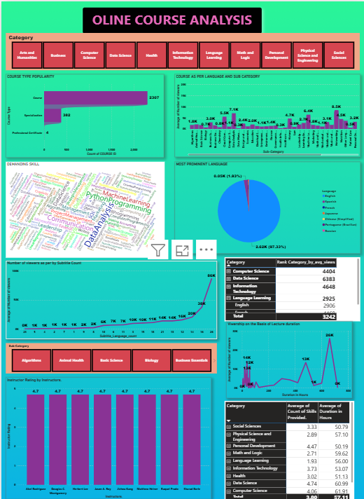

# 📊 Online Course Analysis Dashboard

## 📌 Overview
This project is a Power BI dashboard that analyzes online course data to provide insights into course performance, ratings, duration, skill demand, and course levels through interactive visualizations.

## 🎯 Project Objective

Analyze online course data to identify trends in course ratings, duration, skill demand, and learner engagement through an interactive Power BI dashboard.

## 🚀 Features
- Interactive Dashboard
- KPI Cards
- Course Rating Analysis
- Course Duration Analysis
- Skill Distribution
- Course Level Analysis
- Power Query Data Cleaning
- DAX Measures

## 🛠️ Technologies Used
- Power BI
- Power Query (M Language)
- DAX
- Microsoft Excel

## 📷 Dashboard Preview

  

## 📂 Repository Contents
- `OLINE COURSE ANALYSIS power bi.pbix` – Power BI dashboard
- `dashboard.png` – Dashboard screenshot
- `README.md` – Project documentation

## ▶️ How to Use
1. Download the `.pbix` file.
2. Open it using Microsoft Power BI Desktop.
3. Refresh the data if required.

## 👨‍💻 Author
**Ayush Dubey**
