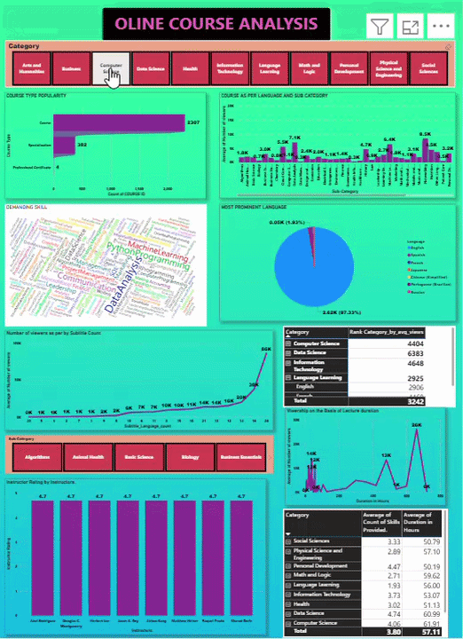

# 📊 Online Course Analysis Dashboard

## 📌 Problem Statement

An EdTech startup aims to expand its recorded lecture offerings by analyzing course data collected from multiple online learning platforms. The objective is to uncover learner preferences, engagement patterns, and market trends to support data-driven business decisions.

## 🎯 Business Objectives

This dashboard helps answer key business questions:

- 📚 Analyze course distribution across categories and subcategories.
- 👀 Measure average course views by category, subcategory, and language.
- 💡 Identify the most in-demand skills across different categories.
- 🌍 Analyze course language distribution and learner preferences.
- 🎬 Evaluate the impact of subtitles on course engagement.
- ⭐ Identify the top 3 instructors based on course ratings.
- ⏱️ Examine the relationship between course duration and viewer engagement.
- 📈 Analyze how skill diversity influences course popularity.

## 🛠️ Technologies Used

- Power BI
- Power Query (M Language)
- DAX
- Microsoft Excel

## 📊 Dashboard Features

- KPI Cards
- Interactive Slicers
- Category & Subcategory Analysis
- Language Analysis
- Skill Analysis
- Instructor Ranking
- Duration vs Views Analysis
- Subtitle Impact Analysis

## 🎥 Dashboard Demo

  

## 📷 Dashboard Preview

  

## 📂 Repository Contents

- `Online_Course_Analysis.pbix`
- `dashboard-demo.gif`
- `dashboard.png`
- `README.md`

## 📈 Key Insights

- Identified the most popular course categories and subcategories.
- Analyzed learner language preferences across top-performing categories.
- Evaluated the influence of subtitles on viewer engagement.
- Identified top-rated instructors for potential collaboration.
- Explored the relationship between course duration and viewer engagement.
- Highlighted the most in-demand skills across educational categories.
## 👨‍💻 Author
**Ayush Dubey**
